# 🛒 E-Commerce Microservices Platform

> A **production-grade**, event-driven microservices platform built with Java 21 and Spring Boot 4 — engineered to solve real-world distributed systems challenges in e-commerce: independent deployability, data isolation, asynchronous communication, and observable operations.

[](https://openjdk.org/projects/jdk/21/)
[](https://spring.io/projects/spring-boot)
[](https://www.postgresql.org/)
[](https://kafka.apache.org/)
[](https://www.docker.com/)
[](LICENSE)

---

## Table of Contents

- [Executive Summary](#executive-summary)
- [Architecture Overview](#architecture-overview)
- [Key Features](#key-features)
- [Tech Stack](#tech-stack)
- [Why This Stack?](#why-this-stack)
- [Project Status & Roadmap](#project-status--roadmap)
- [Project Structure](#project-structure)
- [Getting Started](#getting-started)
- [API Documentation](#api-documentation)
- [Testing Strategy](#testing-strategy)
- [Contributing](#contributing)
- [License](#license)

---

## Executive Summary

This project is a **fully functional e-commerce backend platform** designed as a portfolio-grade showcase of enterprise architecture, automated testing, and DevOps best practices. It is **not** a tutorial or a proof-of-concept — it is a system built with the same rigor applied to production workloads: clean layered architecture, strict input validation, structured error handling, comprehensive test coverage, and containerized infrastructure.

**What this project demonstrates:**

| Competency Area | Implementation |
|---|---|
| **Architecture** | Independent microservices with isolated databases (Database-per-Service pattern) |
| **API Design** | RESTful APIs with full CRUD, pagination, PATCH/PUT semantics, OpenAPI docs |
| **Data Layer** | Spring Data JPA with PostgreSQL, proper entity lifecycle management |
| **Error Handling** | Global exception handlers, structured error codes, machine-parseable logs |
| **Testing** | Multi-layer strategy — unit (JUnit 5 + Mockito), integration (H2), controller (MockMvc) |
| **Infrastructure** | Docker Compose for local development, production-ready containerization |
| **Observability** | Spring Boot Actuator endpoints, structured logging with error codes |

---

## Architecture Overview

The platform follows a **microservices architecture** where each service owns its data, exposes a versioned REST API, and communicates asynchronously through Apache Kafka for event-driven workflows.

```mermaid
graph TB
    Client["🌐 Client / API Consumer"]

    subgraph API_LAYER["API Layer"]
        GW["API Gateway<br/><i>Spring Cloud Gateway</i>"]
    end

    subgraph SERVICES["Microservices"]
        US["👤 User Service<br/><code>:8081</code>"]
        PS["📦 Product Service<br/><code>:8082</code>"]
        OS["🛒 Order Service<br/><code>:8083</code>"]
        NS["🔔 Notification Service<br/><code>:8084</code>"]
    end

    subgraph DATA["Data Layer — Database per Service"]
        UDB[("User DB<br/><i>PostgreSQL :15432</i>")]
        PDB[("Product DB<br/><i>PostgreSQL :25432</i>")]
        ODB[("Order DB<br/><i>PostgreSQL :35432</i>")]
    end

    subgraph MESSAGING["Event Streaming"]
        KAFKA["Apache Kafka Cluster<br/><i>Zookeeper + Broker</i>"]
    end

    Client --> GW
    GW --> US
    GW --> PS
    GW --> OS

    US --> UDB
    PS --> PDB
    OS --> ODB

    US -- "UserCreated /" --> KAFKA
    PS -- "StockUpdated /" --> KAFKA
    OS -- "OrderPlaced /" --> KAFKA
    KAFKA -- "/ consume" --> NS

    style Client fill:#374151,stroke:#9CA3AF,color:#F9FAFB
    style GW fill:#1E40AF,stroke:#3B82F6,color:#F9FAFB
    style US fill:#065F46,stroke:#10B981,color:#F9FAFB
    style PS fill:#065F46,stroke:#10B981,color:#F9FAFB
    style OS fill:#65600A,stroke:#EAB308,color:#1a1a1a
    style NS fill:#65600A,stroke:#EAB308,color:#1a1a1a
    style UDB fill:#1E3A5F,stroke:#60A5FA,color:#F9FAFB
    style PDB fill:#1E3A5F,stroke:#60A5FA,color:#F9FAFB
    style ODB fill:#1E3A5F,stroke:#60A5FA,color:#F9FAFB
    style KAFKA fill:#7F1D1D,stroke:#EF4444,color:#F9FAFB
```



> **Legend:** 🟢 Green = Implemented  |  🟡 Yellow = Planned (next milestone)

**Core Design Decisions:**
- **Database-per-Service**: Each microservice has its own PostgreSQL instance — no shared state, no tight coupling
- **Event-Driven Communication**: Services publish domain events to Kafka; downstream services react asynchronously
- **API Gateway**: Single entry point for clients; handles routing, load balancing, and cross-cutting concerns
- **Versioned APIs**: All endpoints follow `/api/v1/` convention for backward-compatible evolution

---

## Key Features

### ✅ Implemented

- **User Service** — Full CRUD with role-based user model (`CUSTOMER`, `SELLER`, `ADMIN`), username/email uniqueness enforcement, PATCH + PUT update semantics, pagination with configurable page sizes
- **Product Service** — Product and Category management with relational data model, stock tracking, DTO mapping layer
- **OpenAPI Documentation** — Interactive Swagger UI auto-generated via SpringDoc for every endpoint
- **Structured Error Handling** — Global `@ControllerAdvice` with machine-parseable error codes (`USR-XXX`) for observability pipelines (ELK, Datadog, Grafana Loki)
- **Multi-Layer Testing** — Unit tests (JUnit 5 + Mockito), repository tests (H2 in-memory), integration tests (Spring Boot Test), controller tests (MockMvc)
- **Spring Boot Actuator** — Health checks, metrics, and environment info exposed for monitoring
- **Containerized Databases** — Each service backed by a dedicated PostgreSQL 16 container via Docker Compose with health checks and resource limits

### 🔜 Coming Next

- **Apache Kafka Integration** — Event publishing/consuming for order placed, stock updated, user created events
- **Notification Service** — Real-time event consumer for email/push notifications
- **Order Service** — Order lifecycle management with saga-based coordination
- **API Gateway** — Spring Cloud Gateway with route configuration, rate limiting, and circuit breaking (Resilience4j)
- **Service Discovery** — Eureka-based dynamic registration and load balancing
- **Security Layer** — JWT authentication with Spring Security and role-based authorization
- **Observability Stack** — Centralized logging (ELK), metrics (Prometheus + Grafana), Kafka monitoring (Kafka UI)
- **Cloud Deployment** — Kubernetes manifests, Strimzi Kafka operator, CI/CD pipeline (GitHub Actions), AWS EKS deployment

---

## Tech Stack

| Layer | Technology | Version |
|---|---|---|
| **Language** | Java (LTS) | 21 |
| **Framework** | Spring Boot | 4.0.0 |
| **ORM** | Spring Data JPA / Hibernate | — |
| **Database** | PostgreSQL | 16 |
| **Message Broker** | Apache Kafka | 3.6 |
| **Build Tool** | Apache Maven | 3.9+ |
| **API Docs** | SpringDoc OpenAPI (Swagger) | 3.0.0 |
| **Containerization** | Docker + Docker Compose | 20.10+ |
| **Orchestration** | Kubernetes (planned) | — |
| **CI/CD** | GitHub Actions (planned) | — |
| **Cloud** | AWS EKS (planned) | — |

### Testing Stack

| Tool | Purpose |
|---|---|
| JUnit 5 (Jupiter) | Unit testing framework |
| Mockito 5.x | Mocking and stubbing |
| AssertJ | Fluent assertion library |
| Spring Boot Test | Integration test support |
| H2 Database | In-memory database for repository tests |
| MockMvc | Controller-layer testing without HTTP overhead |

---

## Why This Stack?

> _"Technology choices should outlive the sprint they were made in."_

| Decision | Rationale |
|---|---|
| **Java 21 LTS** | Long-term support until **2029+**. Access to virtual threads (Project Loom), pattern matching, sealed classes, and record types — features that reduce boilerplate and improve readability in complex domain models. The LTS commitment signals production seriousness. |
| **Spring Boot 4.0.0** | Built on **Spring Framework 7** with first-class Java 21 support, Jakarta EE 11 namespace, and native AOT compilation readiness. Positions the codebase for the next 3-5 years of the Spring ecosystem. |
| **PostgreSQL 16** | The most advanced open-source relational database. Chosen over MySQL for its superior support of JSONB, full-text search, and advanced indexing — capabilities needed as the platform scales. |
| **Apache Kafka** | De facto standard for event streaming in distributed systems. Unlike RabbitMQ, Kafka provides **durable, replayable event logs** — critical for audit trails, event sourcing, and eventual consistency patterns. |
| **Database-per-Service** | Enforces true microservice independence. No shared schema means services can evolve, scale, and deploy independently — the entire point of a microservices architecture. |
| **Docker Compose for Dev** | Mirrors the production topology locally. Developers can spin up the entire platform with a single command, with health checks and resource limits matching production constraints. |

---

## Project Status & Roadmap

The project follows an incremental development approach. Each phase builds on the previous one, progressively adding layers of complexity.

| Phase | Milestone | Status | Details |
|---|---|---|---|
| **Phase 1** | Core Microservices | ✅ Complete | User Service, Product Service — full CRUD, validation, error handling, DTO mapping |
| **Phase 1** | Automated Testing | ✅ Complete | Unit, integration, and controller tests with JUnit 5, Mockito, H2 |
| **Phase 1** | Docker Setup | ✅ Complete | Per-service PostgreSQL containers with health checks and resource limits |
| **Phase 1** | API Documentation | ✅ Complete | SpringDoc OpenAPI / Swagger UI for all endpoints |
| **Phase 2** | Event-Driven Architecture | 🔧 In Progress | Kafka cluster setup, event publishing, Notification Service |
| **Phase 2** | Order Service | 📋 Planned | Order lifecycle, saga coordination, Kafka integration |
| **Phase 3** | API Gateway & Discovery | 📋 Planned | Spring Cloud Gateway, Eureka, Config Server, Resilience4j |
| **Phase 4** | Security & Monitoring | 📋 Planned | JWT auth, Spring Security, ELK Stack, Prometheus + Grafana |
| **Phase 5** | Cloud Deployment | 📋 Planned | Kubernetes manifests, CI/CD (GitHub Actions), AWS EKS, SSL |

---

## Project Structure

```
ecommerce-microservice/
├── infrastructure/
│   └── docker/
│       ├── userdb-compose.yml          # PostgreSQL for User Service (:15432)
│       └── productdb-compose.yaml      # PostgreSQL for Product Service (:25432)
│
├── user-service/                       # 👤 User Management Microservice
│   └── src/
│       ├── main/java/com/ecommerce/user/
│       │   ├── controller/             # REST endpoints + OpenAPI annotations
│       │   ├── service/impl/           # Business logic layer
│       │   ├── repository/             # Spring Data JPA repositories
│       │   ├── model/                  # JPA entities (User, UserRole)
│       │   ├── dto/                    # Request/Response DTOs (records)
│       │   ├── mapper/                 # Entity ↔ DTO mappers
│       │   ├── exception/              # Global handler + custom exceptions
│       │   └── constant/               # Error codes (LogCode, ErrorConstants)
│       └── test/                       # Unit, integration & controller tests
│
├── product-service/                    # 📦 Product Catalog Microservice
│   └── src/
│       ├── main/java/com/ecommerce/product/
│       │   ├── controller/             # REST endpoints
│       │   ├── repository/             # Spring Data JPA repositories
│       │   ├── model/                  # JPA entities (Product, Category)
│       │   ├── dto/                    # Request/Response DTOs
│       │   └── mapper/                 # Entity ↔ DTO mappers
│       └── test/                       # Service tests
│
├── pom.xml                             # Parent POM (multi-module Maven)
├── LICENSE                             # MIT License
└── README.md
```

---

## Getting Started

### Prerequisites

| Tool | Minimum Version | Installation |
|---|---|---|
| Java JDK | 21 | [Download](https://adoptium.net/) |
| Maven | 3.9+ | [Download](https://maven.apache.org/download.cgi) |
| Docker & Docker Compose | 20.10+ | [Download](https://docs.docker.com/get-docker/) |
| Git | 2.x | [Download](https://git-scm.com/) |

### 1. Clone the Repository

```bash
git clone https://github.com/SasiPiro/ecommerce-microservice.git
cd ecommerce-microservice
```

### 2. Start the Databases

Each microservice has its own PostgreSQL instance managed via Docker Compose:

```bash
# Start User Service database (port 15432)
docker compose -f infrastructure/docker/userdb-compose.yml up -d

# Start Product Service database (port 25432)
docker compose -f infrastructure/docker/productdb-compose.yaml up -d
```

Verify both databases are healthy:

```bash
docker ps --format "table {{.Names}}\t{{.Status}}\t{{.Ports}}"
```

Expected output:
```
NAMES        STATUS                   PORTS
user-db      Up ... (healthy)         0.0.0.0:15432->5432/tcp
product-db   Up ... (healthy)         0.0.0.0:25432->5432/tcp
```

### 3. Build & Run the Services

```bash
# Build the entire multi-module project
./mvnw clean install

# Run User Service (port 8081)
./mvnw -pl user-service spring-boot:run

# In a separate terminal — Run Product Service (port 8082)
./mvnw -pl product-service spring-boot:run
```

### 4. Verify the Services

```bash
# User Service health check
curl http://localhost:8081/actuator/health

# Product Service health check
curl http://localhost:8082/actuator/health

# Create a test user
curl -X POST http://localhost:8081/api/v1/users \
  -H "Content-Type: application/json" \
  -d '{
    "username": "john_doe",
    "email": "john@example.com",
    "password": "SecurePass123",
    "firstName": "John",
    "lastName": "Doe"
  }'
```

---

## API Documentation

Once the services are running, interactive API documentation is available via **Swagger UI**:

| Service | Swagger UI | OpenAPI Spec |
|---|---|---|
| **User Service** | [http://localhost:8081/swagger-ui.html](http://localhost:8081/swagger-ui.html) | [/v3/api-docs](http://localhost:8081/v3/api-docs) |
| **Product Service** | [http://localhost:8082/swagger-ui.html](http://localhost:8082/swagger-ui.html) | [/v3/api-docs](http://localhost:8082/v3/api-docs) |

### User Service API Summary

| Method | Endpoint | Description |
|---|---|---|
| `POST` | `/api/v1/users` | Create a new user |
| `GET` | `/api/v1/users` | List all users (paginated) |
| `GET` | `/api/v1/users/{id}` | Get user by ID |
| `GET` | `/api/v1/users/search-username?username=` | Search user by username |
| `PUT` | `/api/v1/users/{id}` | Full update (replace) |
| `PATCH` | `/api/v1/users/{id}` | Partial update (merge) |
| `DELETE` | `/api/v1/users/{id}` | Delete user |

---

## Testing Strategy

The project implements a **multi-layer testing pyramid** to maximize confidence while keeping feedback loops fast.

```
        ╭────────────────╮
        │  Integration   │  ← Full context (Spring Boot + H2)
        │    Tests       │
        ╰───────┬────────╯
        ╭───────┴────────╮
        │  Controller    │  ← MockMvc (HTTP layer without server)
        │    Tests       │
        ╰───────┬────────╯
    ╭───────────┴────────────╮
    │     Unit Tests         │  ← JUnit 5 + Mockito (isolated logic)
    │  Service / Repository  │
    ╰────────────────────────╯
```

### Running Tests

```bash
# Run all tests across all modules
./mvnw test

# Run tests for a specific service
./mvnw -pl user-service test

# Run a specific test class
./mvnw -pl user-service test -Dtest=UserControllerTest
```

### Test Coverage Highlights

| Test Type | Scope | Tools |
|---|---|---|
| **Unit Tests** | Service layer business logic | JUnit 5, Mockito, AssertJ |
| **Repository Tests** | JPA queries and entity persistence | Spring Data JPA Test, H2 |
| **Controller Tests** | HTTP request/response handling | MockMvc, Spring Web Test |
| **Integration Tests** | End-to-end request flow | Spring Boot Test, H2 |

---

## License

This project is licensed under the **MIT License** — see the [LICENSE](LICENSE) file for details.

---

<p align="center">
  <b>Built with ☕ Java 21 and a passion for clean architecture</b>
  <br/>
  <sub>Designed as a production-ready showcase for distributed systems engineering</sub>
</p>
